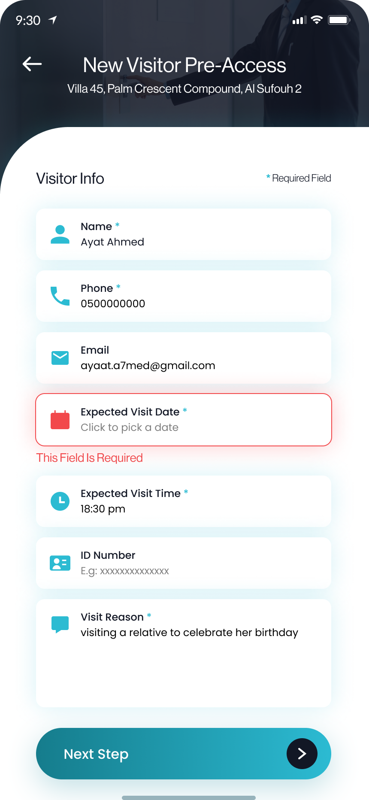

# Test X APP

## Overview

The **Test X APP** is a Flutter application developed as part of a hiring test task. The main objective of this project was to design and implement UI screens from a Figma design and incorporate basic logic, all within a 2-day deadline. In addition to the UI design, some additional logic implementation was added to make the app more functional.

**Figma Design**: [Test X Figma Design](https://www.figma.com/design/EIBMIwuI6joQASbFo0u1nK/test-x-app?node-id=0-1&node-type=canvas&t=VwRjCt6wyIZUEIJw-0)

## Features

- UI design implemented based on Figma mockup.
- Additional business logic implemented beyond the design specifications.
- Responsive UI using `flutter_screenutil` for layout scaling.
- Internationalization support using the `intl` package.
- Share functionality using `share_plus` package.
- File path handling via `path_provider` for device storage access.

## Installation

### Prerequisites

To run this project, you'll need the following installed:

- Flutter SDK (Follow the installation guide [here](https://flutter.dev/docs/get-started/install))
- Android Studio or Xcode for running the app on a device or emulator.

### Steps to Run

1. Clone this repository to your local machine.
   
   ```bash
   git clone <repository-url>
   ```

2. Install the necessary dependencies.

   ```bash
   flutter pub get
   ```

3. Connect your device or start an emulator.

4. Run the app using the following command:

   ```bash
   flutter run
   ```

5. Alternatively, you can install the APK from the **Releases** section and run it directly on an Android device.

## Usage

- This app doesn't have a complex setup or additional user interactions at this stage. Simply launch the app after installation to view the screens designed in Figma, and interact with any implemented functionality.

## Screenshots

 


## Used Packages

- `flutter_screenutil: ^5.9.3` - For responsive screen layout scaling.
- `intl: ^0.20.0` - For internationalization support.
- `share_plus: ^10.0.0` - To enable sharing functionality.
- `path_provider: ^2.1.4` - To handle file storage paths on the device.

## License

No specific license is provided for this project.

## Future Improvements

- **Add more screens and functionality**: Depending on the requirements, more features can be added.
- **Enhance UI**: Improve visual elements and animations.
- **Implement API calls**: To integrate with a backend service.

